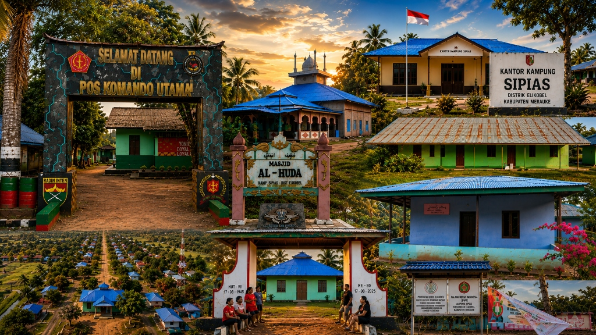

# 🌿 Website Profil Kampung Sipias

<p align="center">
  
</p>

<p align="center">
  <strong>Website resmi profil Kampung Sipias, Distrik Elikobel, Kabupaten Merauke, Provinsi Papua Selatan</strong><br>
  Dikembangkan dalam rangka program <strong>KKN Universitas Musamus (UNMUS) 2026</strong>
</p>

<p align="center">
  
  
  
  
</p>

---

## 📋 Daftar Isi

- [Tentang Proyek](#-tentang-proyek)
- [Fitur Utama](#-fitur-utama)
- [Teknologi yang Digunakan](#-teknologi-yang-digunakan)
- [Struktur Proyek](#-struktur-proyek)
- [Cara Instalasi](#-cara-instalasi)
- [Konfigurasi](#-konfigurasi)
- [Menjalankan Aplikasi](#-menjalankan-aplikasi)
- [Halaman & URL](#-halaman--url)
- [Panel Admin](#-panel-admin)
- [Model Database](#-model-database)
- [Kontribusi](#-kontribusi)

---

## 🏘️ Tentang Proyek

Website Profil Kampung Sipias adalah aplikasi web berbasis **Django 5.2** yang berfungsi sebagai portal informasi resmi Kampung Sipias. Website ini menyajikan berbagai informasi penting kampung seperti profil, sejarah, visi & misi, struktur organisasi perangkat kampung, berita & pengumuman, galeri foto, data fasilitas, serta form kontak.

Website ini dikembangkan sebagai bagian dari program **Kuliah Kerja Nyata (KKN) Universitas Musamus (UNMUS) 2026** untuk membantu modernisasi layanan informasi publik di Kampung Sipias.

---

## ✨ Fitur Utama

### 🌐 Halaman Publik
| Fitur | Keterangan |
|---|---|
| **Beranda** | Hero section dengan foto kampung, statistik, profil singkat, galeri unggulan, dan peta wilayah |
| **Profil Kampung** | Informasi lengkap kampung, sambutan kepala kampung, data kependudukan, dan fasilitas |
| **Sejarah Kampung** | Narasi sejarah berdirinya Kampung Sipias |
| **Visi & Misi** | Visi dan misi pembangunan kampung |
| **Peta Wilayah** | Embed peta Google Maps lokasi kampung |
| **Fasilitas Kampung** | Galeri foto fasilitas (kesehatan, pendidikan, ibadah, umum) dengan tampilan kategori |
| **Struktur Organisasi** | Kartu perangkat pemerintah kampung dan anggota BPK |
| **Berita & Pengumuman** | Daftar dan detail artikel berita/pengumuman/kegiatan |
| **Galeri Foto** | Galeri foto kampung yang dapat difilter per album |
| **Kontak** | Form pengiriman pesan ke pengelola kampung |

### 🔐 Panel Admin (Admin Custom)
| Fitur | Keterangan |
|---|---|
| **Dashboard** | Ringkasan data: jumlah berita, foto, pesan belum dibaca |
| **Kelola Berita** | Tambah, edit, hapus berita dengan editor CKEditor 5 (rich text) |
| **Kelola Galeri** | Upload, edit, hapus foto galeri beserta album |
| **Kelola Fasilitas** | Upload dan kelola foto fasilitas per kategori |
| **Edit Profil Kampung** | Update semua data kampung termasuk foto kepala, foto kantor, peta, dll. |
| **Kotak Pesan** | Lihat dan tandai pesan dari form kontak |

### 🛠️ Fitur Teknis
- **Responsive Design** — Tampilan optimal di desktop, tablet, dan mobile
- **Auto HEIC Converter** — Foto format HEIC/HEIF dari iPhone dikonversi otomatis ke JPEG
- **CKEditor 5** — Rich text editor untuk penulisan konten berita
- **WhiteNoise** — Serving file statis efisien tanpa web server eksternal
- **Context Processor** — Data profil kampung tersedia global di semua template

---

## 🛠️ Teknologi yang Digunakan

| Komponen | Teknologi | Versi |
|---|---|---|
| **Backend Framework** | Django | 5.2.16 |
| **Bahasa Pemrograman** | Python | 3.x |
| **Database** | SQLite3 | — |
| **Rich Text Editor** | django-ckeditor-5 | 0.2.20 |
| **Image Processing** | Pillow | 12.3.0 |
| **Static Files** | WhiteNoise | 6.12.0 |
| **Frontend CSS** | Vanilla CSS (custom) | — |
| **Ikon** | Bootstrap Icons | 1.11.3 |
| **Font** | Plus Jakarta Sans, Outfit (Google Fonts) | — |

---

## 📁 Struktur Proyek

```
kampung-sipias/
│
├── kampung_sipias/          # Konfigurasi utama Django
│   ├── settings.py          # Pengaturan aplikasi
│   ├── urls.py              # URL routing utama
│   ├── wsgi.py              # WSGI entry point
│   └── asgi.py              # ASGI entry point
│
├── core/                    # App utama (profil, pemerintahan, kontak)
│   ├── models.py            # Model: ProfilKampung, FotoFasilitas, StrukturOrganisasi, PesanKontak
│   ├── views.py             # Views halaman publik
│   ├── admin_views.py       # Views panel admin custom
│   ├── admin_urls.py        # URL routing panel admin
│   ├── urls.py              # URL routing halaman publik
│   ├── context_processors.py # Data profil global
│   ├── utils.py             # Auto HEIC converter
│   └── admin.py             # Registrasi Django admin
│
├── berita/                  # App berita & pengumuman
│   ├── models.py            # Model: KategoriBerita, Berita, FotoBerita
│   ├── views.py             # Views daftar & detail berita
│   └── urls.py              # URL routing berita
│
├── galeri/                  # App galeri foto
│   ├── models.py            # Model: AlbumGaleri, FotoGaleri
│   ├── views.py             # Views galeri
│   └── urls.py              # URL routing galeri
│
├── templates/               # Template HTML
│   ├── base.html            # Base template (navbar + footer)
│   ├── core/                # Template halaman publik
│   │   ├── landing.html     # Beranda
│   │   ├── profil.html      # Profil kampung
│   │   ├── sejarah.html     # Sejarah
│   │   ├── visi_misi.html   # Visi & Misi
│   │   ├── peta.html        # Peta wilayah
│   │   ├── fasilitas.html   # Fasilitas kampung
│   │   ├── pemerintahan.html# Struktur organisasi
│   │   └── kontak.html      # Form kontak
│   ├── berita/              # Template berita
│   │   ├── daftar.html      # Daftar berita
│   │   └── detail.html      # Detail berita
│   ├── galeri/              # Template galeri
│   └── admin_panel/         # Template panel admin
│
├── static/                  # File statis sumber
│   ├── css/
│   │   └── style.css        # Stylesheet utama (1900+ baris)
│   ├── js/
│   │   └── main.js          # JavaScript interaksi
│   └── images/              # Gambar statis (logo, hero, dll.)
│
├── staticfiles/             # File statis hasil collectstatic
├── media/                   # File upload (foto, gambar)
├── db.sqlite3               # Database SQLite
├── manage.py                # Django management script
└── requirements.txt         # Dependensi Python
```

---

## 🚀 Cara Instalasi

### Prasyarat
- **Python 3.10+** sudah terinstall
- **Git** (opsional, untuk clone)
- **pip** (package manager Python)

### Langkah-langkah

**1. Clone atau download repositori**
```bash
git clone https://github.com/username/kampung-sipias.git
cd kampung-sipias
```

**2. Buat dan aktifkan virtual environment**

Windows:
```bash
python -m venv venv
venv\Scripts\activate
```

Linux / macOS:
```bash
python3 -m venv venv
source venv/bin/activate
```

**3. Install semua dependensi**
```bash
pip install -r requirements.txt
```

**4. Jalankan migrasi database**
```bash
python manage.py migrate
```

**5. Akun admin default**
- **Username:** `kampungsipias`
- **Password:** `kampungsipias123`

**6. Kumpulkan file statis**
```bash
python manage.py collectstatic --noinput
```

**7. (Opsional) Isi data awal**
```bash
python setup_data.py          # Data profil kampung dasar
python populate_organisasi.py # Data struktur organisasi
python populate_foto_fasilitas.py # Foto fasilitas
```

**8. Jalankan server**
```bash
python manage.py runserver
```

Buka browser dan akses: **http://127.0.0.1:8000**

---

## ⚙️ Konfigurasi

File konfigurasi utama ada di `kampung_sipias/settings.py`.

### Pengaturan Penting

```python
# Mode debug (nonaktifkan di production)
DEBUG = True

# Zona waktu
TIME_ZONE = 'Asia/Jayapura'

# Bahasa
LANGUAGE_CODE = 'id'

# Database (SQLite untuk development)
DATABASES = {
    'default': {
        'ENGINE': 'django.db.backends.sqlite3',
        'NAME': BASE_DIR / 'db.sqlite3',
    }
}

# Lokasi file media (foto upload)
MEDIA_ROOT = BASE_DIR / 'media'
MEDIA_URL = '/media/'

# Lokasi file statis
STATIC_ROOT = BASE_DIR / 'staticfiles'
```

### Untuk Production
> ⚠️ **Penting!** Sebelum deploy ke server produksi, lakukan perubahan berikut:

1. Ganti `SECRET_KEY` dengan nilai acak yang aman
2. Set `DEBUG = False`
3. Isi `ALLOWED_HOSTS` dengan domain/IP server
4. Gunakan database PostgreSQL/MySQL (disarankan)
5. Konfigurasi web server (Nginx/Apache) + Gunicorn

---

## ▶️ Menjalankan Aplikasi

```bash
# Aktifkan virtual environment terlebih dahulu
venv\Scripts\activate          # Windows
source venv/bin/activate        # Linux/macOS

# Jalankan development server
python manage.py runserver

# Jalankan di port tertentu
python manage.py runserver 8080

# Jalankan agar bisa diakses dari jaringan lokal
python manage.py runserver 0.0.0.0:8000
```

---

## 🔗 Halaman & URL

### Halaman Publik

| URL | Nama | Keterangan |
|---|---|---|
| `/` | Beranda | Halaman utama |
| `/profil/` | Profil Kampung | Informasi lengkap kampung |
| `/sejarah/` | Sejarah | Sejarah kampung |
| `/visi-misi/` | Visi & Misi | Visi dan misi kampung |
| `/peta/` | Peta Wilayah | Lokasi geografis |
| `/fasilitas/` | Fasilitas | Fasilitas kampung |
| `/pemerintahan/` | Struktur Organisasi | Perangkat kampung |
| `/kontak/` | Kontak | Form pesan |
| `/berita/` | Daftar Berita | Semua berita & pengumuman |
| `/berita/<slug>/` | Detail Berita | Isi artikel berita |
| `/galeri/` | Galeri Foto | Galeri foto kampung |

### Panel Admin

| URL | Keterangan |
|---|---|
| `/admin-panel/login/` | Halaman login admin |
| `/admin-panel/` | Dashboard admin |
| `/admin-panel/berita/` | Kelola berita |
| `/admin-panel/berita/tambah/` | Tambah berita baru |
| `/admin-panel/galeri/` | Kelola galeri |
| `/admin-panel/galeri/upload/` | Upload foto galeri |
| `/admin-panel/fasilitas/` | Kelola foto fasilitas |
| `/admin-panel/fasilitas/upload/` | Upload foto fasilitas |
| `/admin-panel/profil/` | Edit profil kampung |
| `/admin-panel/pesan/` | Lihat pesan masuk |
| `/django-admin/` | Django admin bawaan |

---

## 🔐 Panel Admin

Website menggunakan **custom admin panel** yang dirancang khusus dengan tampilan yang bersih dan mudah digunakan.

### Login
- URL: `http://127.0.0.1:8000/admin-panel/login/`
- **Username:** `kampungsipias`
- **Password:** `kampungsipias123`

### Cara Mengganti Password Admin
```bash
python manage.py shell -c "
from django.contrib.auth.models import User
u = User.objects.get(username='kampungsipias')
u.set_password('password_baru')
u.save()
print('Password berhasil diubah')
"
```

### Fitur Panel Admin

**📰 Kelola Berita**
- Tulis artikel dengan rich text editor CKEditor 5
- Upload gambar utama dan foto galeri tambahan
- Pilih jenis: Berita, Pengumuman, atau Kegiatan
- Atur status: Draft atau Dipublikasikan

**🖼️ Kelola Galeri**
- Upload foto satu per satu
- Kelompokkan ke dalam album
- Tandai foto sebagai "unggulan" untuk tampil di beranda

**🏗️ Kelola Fasilitas**
- Upload foto per kategori: Kesehatan, Pendidikan, Ibadah, Umum
- Tambahkan judul/keterangan foto

**📝 Edit Profil Kampung**
- Update nama kepala kampung, foto kepala, foto kantor
- Update deskripsi, sejarah, visi, misi, letak geografis
- Update data kependudukan (jumlah penduduk, KK)
- Update kontak (alamat, telepon, email)
- Embed kode Google Maps untuk peta interaktif

**📬 Kotak Pesan**
- Lihat semua pesan dari form kontak
- Tandai pesan sudah dibaca

---

## 🗄️ Model Database

### App `core`

**`ProfilKampung`** — Informasi profil kampung (singleton)
```
nama_kampung, distrik, kabupaten, provinsi
luas_wilayah, jumlah_penduduk, jumlah_kk, jumlah_laki, jumlah_perempuan
fasilitas_kesehatan, fasilitas_pendidikan, fasilitas_ibadah, fasilitas_umum
sambutan_kepala, sejarah, visi, misi, letak_geografis
nama_kepala, foto_kepala, foto_kantor
foto_fasilitas_kesehatan, foto_fasilitas_pendidikan, foto_fasilitas_ibadah, foto_fasilitas_umum
email, telepon, alamat, tahun_berdiri, peta_iframe
```

**`FotoFasilitas`** — Foto fasilitas kampung (multiple)
```
kategori (kesehatan/pendidikan/ibadah/umum)
judul, foto, urutan, created_at
```

**`StrukturOrganisasi`** — Perangkat kampung
```
nama, jabatan, jenis (pemerintah/bpk)
foto, urutan, aktif
```

**`PesanKontak`** — Pesan dari form kontak
```
nama, email, subjek, pesan, dibaca, tanggal
```

### App `berita`

**`KategoriBerita`** — Kategori artikel
```
nama, slug
```

**`Berita`** — Artikel berita/pengumuman
```
judul, slug, kategori, jenis (berita/pengumuman/kegiatan)
ringkasan, konten (CKEditor), gambar
penulis, status (draft/published)
tanggal_publish, tanggal_update, views, unggulan
```

**`FotoBerita`** — Foto galeri tambahan per artikel
```
berita (FK), foto, keterangan, urutan
```

### App `galeri`

**`AlbumGaleri`** — Album foto
```
nama, deskripsi, slug, cover, created_at
```

**`FotoGaleri`** — Foto dalam galeri
```
judul, keterangan, foto, album (FK)
tanggal, unggulan
```

---

## 🤝 Kontribusi

Proyek ini dikembangkan oleh mahasiswa KKN UNMUS 2026.

Untuk kontribusi atau laporan bug, silakan:
1. Fork repositori ini
2. Buat branch fitur baru (`git checkout -b fitur/nama-fitur`)
3. Commit perubahan (`git commit -m 'Tambah fitur X'`)
4. Push ke branch (`git push origin fitur/nama-fitur`)
5. Buat Pull Request

---

## 📄 Lisensi

Proyek ini dikembangkan untuk kepentingan publik dalam rangka program KKN UNMUS 2026. Silakan digunakan dan dikembangkan lebih lanjut untuk kemajuan Kampung Sipias.

---

<p align="center">
  Dibuat dengan ❤️ oleh <strong>Tim KKN UNMUS 2026</strong><br>
  untuk <strong>Kampung Sipias · Distrik Elikobel · Kab. Merauke · Papua Selatan</strong>
</p>
